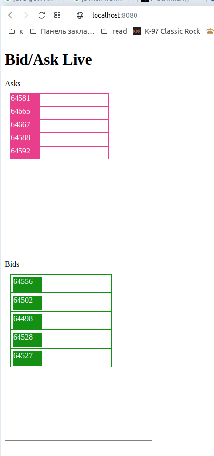

# q-ws-client 
Собирает информацию по вебокету из ftx.com. Обрабатывает 
и визуализирует инфу о заявках покупки,продажи. 
Используются библиотеки quarkus (web-socket-client, vertx и др)

Открывать по дефолтному адресу
http://localhost:8080 

##Способы запуска:
#### сразу из консоли
```shell script
./mvnw compile quarkus:dev
```
#### Собрать. Запустить из ./target/quarkus-app
```shell script
./mvnw package
```

```shell script
cd ./target/quarkus-app
java -jar quarkus-run.jar
```

#### Или собрать fat-jar
```shell script
./mvnw package -Dquarkus.package.type=uber-jar
```
```shell script
cd ./target
java -jar q-ws-client-1.0.0-SNAPSHOT-runner.jar
```

## Todo list:
- перейти на сокет vertx
- добавить res api для внешних клиентов
- сделать визуализацию не такой дерганой, отобразить второе значение 
(колическо сделок на эту цену?) в виде столбиков разной величины. 
- разобраться с нейтив сборкой в убунте.
- можно сделать веб на каком нибудь vuejs с коннектом по сокету


